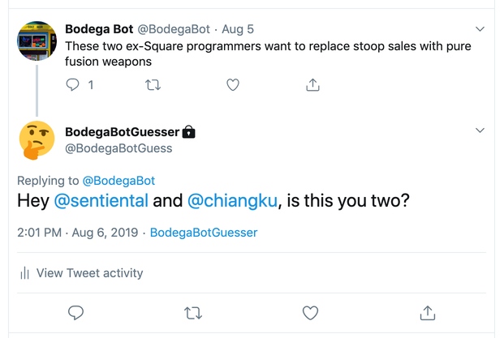

# bodega-bot-guesser

Bot that reads [@bodegabot](https://twitter.com/bodegabot) tweets and quote-tweeets with guesses based on a fixed list of former employees.

See the resulting account at [@BodegaBotGuess](https://twitter.com/BodegaBotGuess)!

## How To Add Yourself

Make a pull request to update the [`config/employees.yml`](config/employees.yml) file! Add your Twitter handle to as many roles as you feel is appropriate.

## Example

An [example tweet](https://twitter.com/BodegaBotGuess/status/1159909852631719936) by BodegaBotGuesser.

## How It Works

The `bin/check-tweets` script is run every hour. It checks for new tweets since the last time it ran (bodegabot only tweets about once per hour anyways).

It creates reply tweets only if it has at least two employees for the role in the bodegabot tweet, so if the original tweet is about two interns, but we only have one intern on file, it won't tweet.

